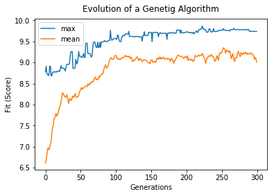

# GenePy

## A Genetic Algorithm Library for Python with studies intent

For more informations on how to use it, see the Demonstration.md archive or roll down.

### Importing the genepy Library

```python
import genepy as gp
```

### Importing Auxiliar Libraries

```python
import numpy as np
import matplotlib.pyplot as plt

rd = np.random
```

### Choosing Parameters

```python
n = 200   # number of individuals (chromosome) in the population
m = 0.01  # chance of a new individual have its DNA mutated
k = 80    # number of best individuals that will pass to the next generation
t = 300   # generations of simulation
```

### Creating Environment and Populatoin

```python
E = gp.Environment()
E.gen_population(n)
```

### Evolving Population

```python
df = []
```

```python
for i in range(t):
    E.evolve(keep=k, mutate=m)
    
    now = []
    now = np.array(list(map(lambda x: x.score, E.curr_pop)))
    
    df.append([now.max(), now.mean()])
```

### Showing Results

```python
plt.plot(df)
plt.title('Evolution of a Genetig Algorithm', y=1.02)
plt.legend(['max', 'mean'])
plt.xlabel('Generations')
plt.ylabel('Fit (Score)')
plt.savefig('example.pdf')
plt.show()
```



```python
before = np.array(list(map(lambda x: x.score, E.start_population)))
print('\n\nBefore, the best score was {} from a mean of {}'.format(before.max(), before.mean()))
print('Now, the best score is {} from a mean of {}\n'.format(now.max(), now.mean()))
```

    Before, the best score was 8.962490485102869 from a mean of 6.657630536882604
    Now, the best score is 9.73845070705315 from a mean of 9.005521806264273

# Conclusions

There is a lot of material to do yet, but the basics are done and the base form is now working
